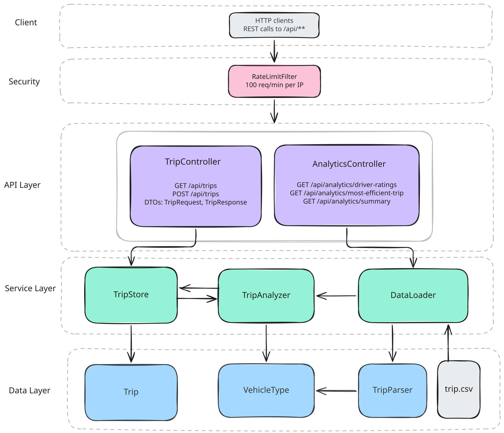

# TripInfo: A Ride-Hailing Driver Performance Analytics Tool

A Java 17 application that parses ride-hailing trip records from a CSV file, validates them,
prints driver performance insights to the console, and exposes a REST API for the same analytics.

---

## Live Deployment

The REST API is hosted on Render:

|                  | URL                                                 |
| ---------------- | --------------------------------------------------- |
| **Base URL**     | https://trip-info-api.onrender.com                  |
| **Swagger UI**   | https://trip-info-api.onrender.com/swagger-ui.html  |
| **OpenAPI JSON** | https://trip-info-api.onrender.com/v3/api-docs      |
| **OpenAPI YAML** | https://trip-info-api.onrender.com/v3/api-docs.yaml |

> **Note:** The API is hosted on Render's free tier. If it hasn't received traffic recently,
> the first request may take ~30 seconds to wake up.

---

## Project Overview

The application is split into two independent layers:

- **Console App** — reads `trips.csv`, validates every record, and prints a formatted analytics
  report to stdout. Built with standard Java only (no Spring Boot).
- **REST API** — a Spring Boot application that loads the same CSV on startup
  and exposes six HTTP endpoints for the same analytics, plus a POST endpoint to add new trips.

Both layers share the same core model, parser, and service classes.

---

## Architecture and Flow Diagram



## Java Version

Java 17 (Spring Boot 3.2.5 requires Java 17+).
Compatible with any JDK 17 or above.

---

## Project Structure

```
src/main/java/com/tripinfo/
  model/
    Trip.java                  Domain object — private fields, getters, getEarningsPerKm()
    VehicleType.java           Enum: SEDAN, SUV — with fromString() for safe parsing
  parser/
    TripParseException.java    Checked exception for a single invalid record
    ParseResult.java           Holds valid trips + error messages after a parse run
    TripParser.java            CSV → Trip conversion; collects errors, never crashes
  service/
    DriverSummary.java         Value object: aggregated stats per driver
    TripAnalyzer.java          All analytics logic (grouping, sorting, filtering)
    TripStore.java             Thread-safe in-memory trip list (CopyOnWriteArrayList)
    DataLoader.java            Reads trips.csv into TripStore on Spring Boot startup
  app/
    TripInfoAnalyticsApp.java  Console application entry point
  api/
    GlobalExceptionHandler.java  @Valid errors → 400 JSON; unknown routes → 404 JSON
    controller/
      TripController.java        GET /api/trips, POST /api/trips
      AnalyticsController.java   Four analytics endpoints + /summary
    dto/
      TripRequest.java           POST body with Bean Validation annotations
      TripResponse.java          GET response shape; protected constructor for subclassing
      EfficientTripResponse.java Extends TripResponse, adds earningsPerKm
      DriverRatingResponse.java  { driverId, averageRating }
      SummaryResponse.java       Combined analytics summary
  config/
    OpenApiConfig.java           Springdoc OpenAPI metadata (title, version, servers)
  security/
    RateLimitFilter.java         100 req/min per IP; HTTP 429 on breach
  TripInfoApiApplication.java    Spring Boot entry point
trips.csv                        Sample dataset (10 valid + 7 edge-case records)
pom.xml                          Maven build — Spring Boot 3.2.5, web + validation + springdoc
Dockerfile                       Multi-stage Docker build for Render deployment
render.yaml                      Render deployment configuration
```

---

## How to Compile and Run — Console Application

The console application uses **standard Java only** (no Maven needed).
Run all commands from the **project root** (`TripInfo/`) so that `trips.csv` is found correctly.

### Compile (macOS / Linux)

```bash
javac -d out \
  src/main/java/com/tripinfo/model/VehicleType.java \
  src/main/java/com/tripinfo/model/Trip.java \
  src/main/java/com/tripinfo/parser/TripParseException.java \
  src/main/java/com/tripinfo/parser/ParseResult.java \
  src/main/java/com/tripinfo/parser/TripParser.java \
  src/main/java/com/tripinfo/service/DriverSummary.java \
  src/main/java/com/tripinfo/service/TripAnalyzer.java \
  src/main/java/com/tripinfo/app/TripInfoAnalyticsApp.java
```

### Compile (Windows PowerShell)

```powershell
mkdir out
javac -d out `
  src\main\java\com\tripinfo\model\VehicleType.java `
  src\main\java\com\tripinfo\model\Trip.java `
  src\main\java\com\tripinfo\parser\TripParseException.java `
  src\main\java\com\tripinfo\parser\ParseResult.java `
  src\main\java\com\tripinfo\parser\TripParser.java `
  src\main\java\com\tripinfo\service\DriverSummary.java `
  src\main\java\com\tripinfo\service\TripAnalyzer.java `
  src\main\java\com\tripinfo\app\TripInfoAnalyticsApp.java
```

### Run

```bash
# Uses trips.csv in the current directory by default
java -cp out com.tripinfo.app.TripInfoAnalyticsApp

# Or pass an explicit path to any CSV file
java -cp out com.tripinfo.app.TripInfoAnalyticsApp path/to/yourfile.csv
```

---

## How to Run — REST API (Spring Boot)

Requires Maven and Java 17+.

```bash
mvn spring-boot:run
```

The server starts on **port 8080**. Place `trips.csv` in the directory from which you run the
command (the `app.data.file` property in `application.properties` controls the path).

Once running, the interactive API docs are available at:

- **Swagger UI:** http://localhost:8080/swagger-ui.html
- **OpenAPI JSON:** http://localhost:8080/v3/api-docs

---

## REST API Endpoints

| Method | URL                                      | Description                          |
| ------ | ---------------------------------------- | ------------------------------------ |
| `GET`  | `/api/trips`                             | All valid trips loaded from CSV      |
| `POST` | `/api/trips`                             | Add a new trip (validated JSON body) |
| `GET`  | `/api/analytics/driver-ratings`          | Avg rating per driver, descending    |
| `GET`  | `/api/analytics/most-efficient-trip`     | Highest fare/km trip                 |
| `GET`  | `/api/analytics/underperforming-drivers` | Avg rating < 3.5, ascending          |
| `GET`  | `/api/analytics/summary`                 | Combined report                      |

### Sample curl commands

```bash
# Get all trips
curl https://trip-info-api.onrender.com/api/trips

# Get driver ratings
curl https://trip-info-api.onrender.com/api/analytics/driver-ratings

# Most efficient trip
curl https://trip-info-api.onrender.com/api/analytics/most-efficient-trip

# Underperforming drivers
curl https://trip-info-api.onrender.com/api/analytics/underperforming-drivers

# Summary report
curl https://trip-info-api.onrender.com/api/analytics/summary

# Add a new trip
curl -X POST https://trip-info-api.onrender.com/api/trips \
  -H "Content-Type: application/json" \
  -d '{
    "driverId": "D106",
    "vehicleType": "Sedan",
    "tripDistanceKm": 9.5,
    "farePaid": 210.00,
    "customerRating": 4.4
  }'
```

### Sample Responses

**GET /api/analytics/driver-ratings**

```json
[
  { "driverId": "D104", "averageRating": 4.8 },
  { "driverId": "D101", "averageRating": 4.7 },
  { "driverId": "D102", "averageRating": 4.0 },
  { "driverId": "D103", "averageRating": 3.2 },
  { "driverId": "D105", "averageRating": 3.05 }
]
```

**GET /api/analytics/most-efficient-trip**

```json
{
  "driverId": "D104",
  "vehicleType": "SUV",
  "tripDistanceKm": 15.0,
  "farePaid": 420.0,
  "customerRating": 4.7,
  "earningsPerKm": 28.0
}
```

**GET /api/analytics/underperforming-drivers**

```json
[
  { "driverId": "D105", "averageRating": 3.05 },
  { "driverId": "D103", "averageRating": 3.2 }
]
```

**POST /api/trips — success**

```json
{ "message": "Trip added successfully" }
```

**POST /api/trips — validation failure**

```json
{
  "error": "Validation failed",
  "details": ["customerRating: customerRating must be <= 5.0"]
}
```

---

## Assumptions

- A trip with `tripDistanceKm = 0.0` is treated as a **valid record** (a cancelled or
  zero-distance trip can legitimately have a fare). It is excluded only from the
  most-efficient-trip calculation, where dividing by zero would produce a meaningless result.
- Customer rating must be in the range **[1.0, 5.0]** inclusive. Ratings outside this range
  are rejected.
- DriverID is capped at **20 characters** as a basic input-length guard.
- The underperforming threshold is **< 3.5** (strictly less than, not ≤).
- `totalInvalidTrips` in the `/summary` endpoint reflects only the initial CSV load.
  Trips added at runtime via POST are already validated before being stored, so they are
  always counted as valid.

---

## Edge-Case Handling

The approach is **collect-and-report**: every record in the CSV is attempted individually.
Invalid records are skipped and their error messages are collected; the application never
terminates on a single bad row. All errors are printed together after processing completes.

| Edge case                             | Handling                                                               |
| ------------------------------------- | ---------------------------------------------------------------------- |
| Missing / too few fields              | Rejected: field-count check (must be exactly 5)                        |
| Non-numeric distance, fare, or rating | Rejected: `NumberFormatException` caught per field                     |
| Negative distance or fare             | Rejected: explicit `< 0.0` check                                       |
| Customer rating outside [1.0, 5.0]    | Rejected: range check                                                  |
| Blank DriverID                        | Rejected: `isEmpty()` check                                            |
| DriverID longer than 20 characters    | Rejected: length check                                                 |
| Unknown vehicle type                  | Rejected: `VehicleType.fromString()` throws `IllegalArgumentException` |
| Trip distance of 0.0                  | Accepted; excluded from most-efficient-trip calculation only           |
| Empty input file                      | Reported as an error; application continues with zero valid trips      |

---

## Sample Console Output

```
==========================================
 Ride-Hailing Driver Performance Analytics
==========================================
Total Valid Trips  : 10
Total Invalid Trips: 7

Skipped Records (invalid data):
  [SKIP] Line 12: Expected 5 fields but found 3. Raw: [D106,Sedan,5.0]
  [SKIP] Line 13: Trip distance 'abc' is not a valid number.
  [SKIP] Line 14: Customer rating 6.0 is outside valid range [1.0, 5.0].
  [SKIP] Line 15: Fare cannot be negative (-50.0).
  [SKIP] Line 16: Trip distance cannot be negative (-3.0).
  [SKIP] Line 17: Invalid vehicle type 'Hatchback'. Accepted: SEDAN, SUV.
  [SKIP] Line 18: DriverID is blank.

Average Rating by Driver:
  D104     -> 4.80
  D101     -> 4.70
  D102     -> 4.00
  D103     -> 3.20
  D105     -> 3.05

Most Efficient Trip:
  Driver  : D104
  Vehicle : SUV
  Distance: 15.0 km
  Fare    : 420.00
  Earnings Per Km: 28.00

Underperforming Drivers (avg rating < 3.5):
  D105     -> Average Rating: 3.05
  D103     -> Average Rating: 3.20

==========================================
```

---

## Security Features (REST API)

- **Input length cap** — DriverID is rejected if it exceeds 20 characters, preventing
  oversized strings from reaching the domain layer.
- **Bean Validation** — `@Valid` on the POST body rejects missing fields, out-of-range values,
  and negative numbers before any service code runs.
- **Request body size limit** — configured in `application.properties` to 10KB, preventing
  memory exhaustion from oversized payloads.
- **Rate limiting** — `RateLimitFilter` allows a maximum of 100 requests per IP per minute,
  responding with HTTP 429 if exceeded. No external library required.
- **No stack trace leakage** — `GlobalExceptionHandler` catches all unhandled exceptions and
  returns a generic 500 message; internal details are logged server-side only.
